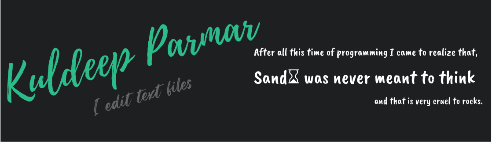

<h1 align="center" >Hello </h1>

My name is Kuldeep Parmar and I'm a developer cum **DevOps** person. I have two passions in tech. The first is building beautiful tools for
people to share knowledge and experience. The second is creating
reliable infrastructure that is easy to use and maintain. 
> **"Perfect is the enemy of good"**  
-Voltaire(1770)  
Trying to shrunk that in with my OCD...

#### Weather in my town:

### Contact:   

## Tools I use :

 

### 📈 Profile stats :

<b> Github Stats</b>

	 
	
	 
	

	
	
<b> Github Streaks</b>

	 
	

## Listening:

	
	
<b>ProgrammerHumor?</b>

	 
<!-- programmer_humor_img starts -->

<!-- programmer_humor_img ends -->

 

<!-- yearProgress starts -->
⏳ Year progress ( █████▁▁▁▁▁▁▁▁▁▁▁▁▁▁▁▁▁▁▁▁▁▁▁▁▁ ) 18.37 %

⏰ Updated on Wed, 09 Mar 2022 01:05:51 GMT

<!-- yearProgress ends -->

